# Well-Being

## Introduction
Well-being is the website of non-profit organization that provides psychotherapy, financial and healthcare services to people who are struggling with daily-life problems. 

Well-being consists of a team of psychologists, economists and healthcare experts with a purpose of identifing the problem of the interested people and set up a plan to make their life better. Their area of focus is based on the three areas of expertise; Health, Social Connections and Financial Stability.

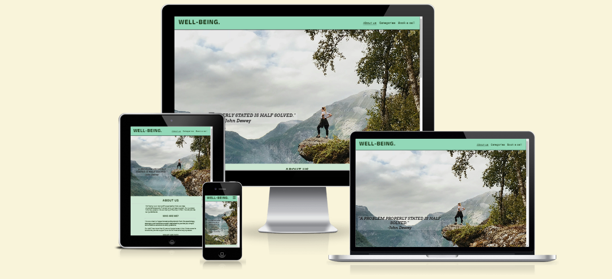

# Table Of Contents

1. [Project Overview](#project-overview)
    - [Project Objective](#project-objective)
    - [User Stories](#user-stories)
    - [Design](#design)
2. [Features](#features)
    - [Header, Footer, Favicon](#header-footer-favicon)
    - [About Us Page](#about-us-page)
    - [Categories Page](#categories-page)
    - [Book a Call Page](#book-a-call-page)
3. [Testing](#testing)
    - [Manual Testing](#manual-testing)
    - [Bugs](#bugs)
    - [Lighthouse - Performance](#lighthouse-performance)
    - [Lighthouse - Accessibility](#lighthouse-accessibility)
    - [Validator Testing](#validator-testing)
4. [Deployment](#deployment)
    - [Technical Issue](#technical-issue)
5. [Credits](#credits)
    - [Content](#content)
    - [Media](#media)

# 1.Project Overview

## 1.1 Project Objective

- The main purpose of this website is to promote a non-profit psychotherapeutic organization.

 - The main purpose of this organization is to encourage people who are struggling with their daily life problems to ask support from experienced professionals. 

  - The user of the website has the opportunity to:

      1. Get brief description of the people who work there. 
      2. Learn more about the purpose, and the way the organization operates.
      3. Read more information about the theoretical basis of this group.
      4. Get in touch to request support.

- The target audience is every person who is struggling with daily-life problems and would like to ask for phychological support.

## 1.2 User stories

### First time user 
- I want to know about what the website is about.
- I want to know more about the people of this organization.
- I want to know what this organization offers.
- I want to know how they provide their services.

### Returning Users 

- I want to know more about the way they operate.
 - I want to know in more details in which areas they can provide support.
- I want to know how I can get in touch.

### Site owner

- I want to promote the activity of the organization. 
- I want to provide information about the importance of the well-being.
- I want to encourage the users to take action in order to improve their life. 
- I want to get in touch with the organization.

# 1.3 Design

 - The website was designed to provide only the necessery information about the organization. If the users want to learn more about the organization and ask suppoort they are encouraged through the website to get in touch by sumbitting the form, which is and the final goal of the website. The point is the context of the pages to be short and accurate so as to keep the user's interest without being tiring. 

   In order to fullfill this purpose, a simple minimalistic design was necessary. To draw the attention of the user I used images relevant to the context of each section. The user can find relevant information about the organization and their way to operate by scrolling down the page or following the navigation links provided in the header.

 - Semantic markup was used to ensure a well structured page.

 - The colour of the page is light green in order to convey happy feelings and it was choosen to match the concept of well- being. The header and the footer has a slightly lighter green color. The point of the different colour betwwen the footer, header and main body is the user to be able to identify the different sectors but at the same time not to create a strong contrast between them. 

   The colour of the the body is a dark green in order to create strong contrast between the background colour and be easily readable. At the same time all the colours of the website match together.

-  Media Queries were used to allow for the layout to adapt to all screen sizes maintaining the structural integrity of the website.

-  I used Flexbox in order to display the elements of the page in a column. With that way the user easily read the sections just by scrolling down through the page both on mobile screens and on desktop computers.

# 2. Features

The website includes three pages. 
1. The [Home page](https://georgebarh.github.io/well-being-Portofolio-1/) that contains information about the organization. 
2. The [Categories page](https://georgebarh.github.io/well-being-Portofolio-1/categories.html) that provides further information about the philosophy of the organization and the way they provide their services.
3. The [Book a Call page](https://georgebarh.github.io/well-being-Portofolio-1/contact.html) that gives the opportunity to the user to sumbit a short form and request an introductury call with the team.

## 2.1 Header, Footer, Favicon
The header,the footer and the favicon are featured in all the pages (index.html, categories.html and contact.html) in order to ensure consistency throughout the whole website. 
 ### __Header__

 The header includes the logo of the organisation/ website (WELL-BEING) to the left and the navigation bar to the right. It is responsive at all screen sizes.
 - The *logo* (WELL-BEING) is an anchor link and links to the About us page (index.html).
  - The *navigation bar* includes three anchor links. In mobile screens responds as a toggle button and in  tablet screens and above (>768 px) the anchor links are displayed side by side. 

      

      
          
    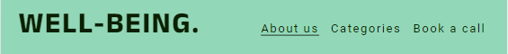
       
        
        
   1. [About us](https://georgebarh.github.io/well-being-Portofolio-1/) : When the user clicks it, links them to the *About us* (index.html).
   2. [Categories page](https://georgebarh.github.io/well-being-Portofolio-1/categories.html) : When the user clicks it, links them to the *Categories page* (categories.html).
   3. [Book a Call page](https://georgebarh.github.io/well-being-Portofolio-1/contact.html) : When the user clicks it, links to the *Book a call page* (contact.html).

    - This section allows to the user to easily navigate through the website without having to revert back to the previous page.

   ###  __Footer__

   - The footer section includes links to the relevant social media sites for Well-being.The links will open in a new tab so as to prevent the user leaves the website. We used font icons for a better user experience.
   - A potential visit to our social media pages means higher interest from the user and increases the credibility of *Well-Being*.
   - It also contains the copyrights of the developer.

   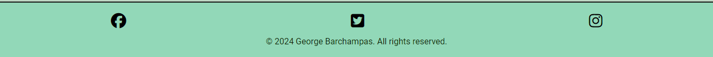

  ###  __Favicon__

   - The favicon is a healthy heart to the left of the title of the page and is choosen according the contect of the website.

   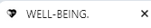

## [2.2 About us page](https://georgebarh.github.io/well-being-Portofolio-1/)

###  __Hero Image__

   - The hero section contains a background image with a cover text of a quote, relevant with the concept of the  website.
   - The background image draws the attention of the user and the, *A problem properly stated is half solved*, statement encourages the user to read more about the organization in order to find directions how to solve his problem.  

   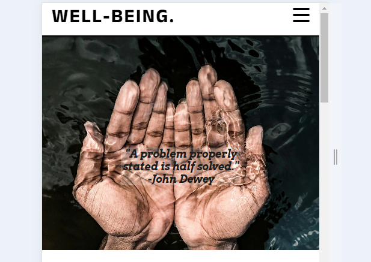

### __About us__
  - The *About us* section is a short brief of the organization. It contains three boxes and each of them includes a question and its answer. Τhe purpose of this structure is for the user to see in front of him what he is already wondering about the organization.  
  
     1. Who these people are: The user have the opportunity to evaluate the educational background of the people with such a difficult work of improving their life.

      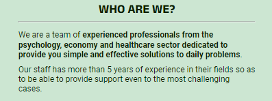

     2. What exactly they do: The user is able to clearly identify what the organization does without being too complicated for them.

    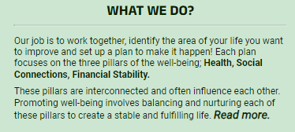

      3. How they do it The user see how the organization's concept works, when he can be in touch with them and what happens after the introductory contact.

      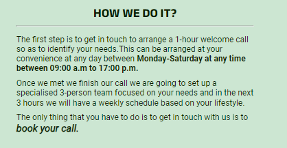

  - Below each question is a brief paragraph that answers the question without giving extra information. The point of this section is to briefly describe the people, the purpose and operation process with a very simple way that encourages the user to request a contact call by using the *Book a call* contact form.

      

### __Video section__ 

   This section contains a short description about the video that follows in the page and the Youtube video of a TED talk.
  - Gives the option to the user to be more familiar with the well-being concept by watching a TED talk from the director of the organization.
   - The presence of the director in a Ted Talk provides credibility to the organization.
   - The Youtube video makes it more familiar for the user and increases the chances of watching the talk and eventually spend more time in the website.

   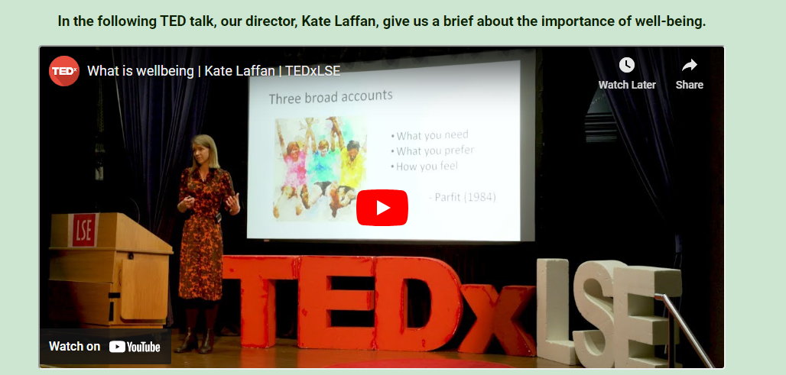

## [2.2 Categories Page](https://georgebarh.github.io/well-being-Portofolio-1/categories.html) 

The categories page constitutes the theoritical basis of the organization. More specifically, the concept of the Well-Being is based on the Three Pillars of Well-Being; Health,Social Connections and Financial Stability. 

This page gives the user the oppurtunity to check how the organization operates, where they base their buisness plan and in which areas of their life they can provide guidance to them. 

### __Introduction__

This section contains the title *The Three pillars of Well-Being*, a nav bar which the user can user so as to navigate through the three sections of the page *(Health, Social Connections and Financial Stability)* and a paragraph that describes the rest of the page's context and encourages the user to read more.

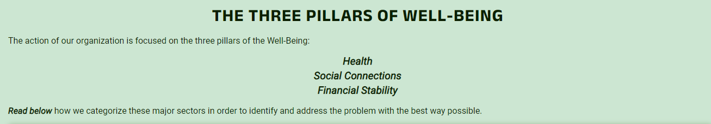

That anchor links give the chance to the user (mostly to the mobile user) not to scroll down and provides interactivity so as to make the website more user friendly.

- Each section contains a heading, an image, relevant to the concept of the section,so as to draw the attention of the user and three sub-categories of each pillar.

- Each section has box shadow around them so as to make it look as a seperate card and improve the user experience and the look of the website.

- The purpose of this design is to get the attention of user and  provide them further information about the areas of life that can get support from the Well-Being team without make the context long and tiring.

### __Health__

The next section has to do with the first pillar of Well-Being, *Health*. This section contains the heading, an image of a girl doing exercise in the nature and below the image the three sub-categories of Health with a brief descpription.

  1. Physical Health
  2. Mental Health
  3. Overal Wellness

### __Social Connections__

The second pillar of Well-Being is *Social Connections*. This section contains the heading, an image of a group of people relaxing in a living room and below the image the three sub-categories of Social Connections with a brief descpription.

  1. Relationships
  2. Community Engagement
  3. Social Support

### __Financial Stability__

The third pillar of Well-Being is *Financial Stability*. This section contains the heading, an image of a table with money, a calculator and a notebook on it and below the image the three sub-categories of Financial Stability with a brief descpription.

  1. Income and Employment
  2. Saving and Investments
  3. Debt Management

- At the bottom of the page there is an anchor that encourages the user to do the next step and book a call with members of the Well-Being team.

 At the bottom of the Categories page the is another anchor link that encourages the user to do the next step after he read the context of this page.
  The next step would be the user to book a call with the Well-being team and he has the option right there after he finished the reading of this page.

 
 

## [2.3 Book a call page](https://georgebarh.github.io/well-being-Portofolio-1/contact.html) 

  - The Book a call page is a form with input fields where the user can submit their contact details so as to get in touch with the Well-Being team.
  The required steps are simple and only needs a first name, a last name, a phone number and email address.  
   - The second part of the page contains a check button and a radio button and gives the opportunity to the user to provide day and time availability for the first call.

   -The point of such a simple page structure is the user to be encouraged to sumbit the form without having to submit a lot of details. The phone number and the *Areas you want to improve* is not a required field. 

   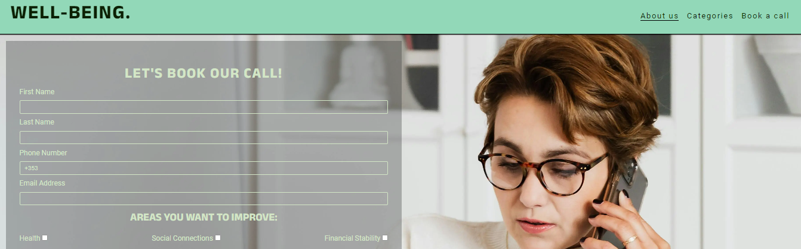
   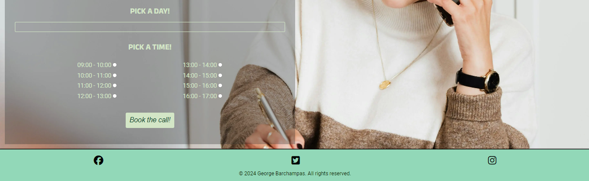

   # 3. Testing

## 3.1 Manual Testing
   I have tested the responsiveness of the website in Google Chrome, Microsoft Edge, and Mozilla Firefox and every thing works as it should.

 ##  Header, Footer
### Header 
  - The *logo* (WELL-BEING) is an anchor link and links to the  [About us](https://georgebarh.github.io/well-being-Portofolio-1/) page.
  - The *navigation bar* includes three anchor links. In mobile screens responds as a toggle button and in  tablet screens and above (>768 px) the anchor links are displayed side by side. 
       
    1. [About us](https://georgebarh.github.io/well-being-Portofolio-1/) : When the user clicks it, links them to the *About us* (index.html).
    2. [Categories page](https://georgebarh.github.io/well-being-Portofolio-1/categories.html) : When the user clicks it, links them to the *Categories page* (categories.html).
    3. [Book a Call page](https://georgebarh.github.io/well-being-Portofolio-1/contact.html) : When the user clicks it, links to the *Book a call page* (contact.html).

- Footer 
  - The footer contains three font awesome icons that each of them links the user to the corresponding social media page. The pages are opening in a new tab in order the user not leave the home page.

  ## [About us Page](https://georgebarh.github.io/well-being-Portofolio-1/index.html#about)

   Except of the navbar in the header, the *About us* page has two anchor links that encourages the user to navigate to the other two pages of the website. Both elements are tested and working as they should.

     1. At the *WHAT WE DO* section the user has the option to click the *Read more* anchor and link to the [Categories page](https://georgebarh.github.io/well-being-Portofolio-1/categories.html).

     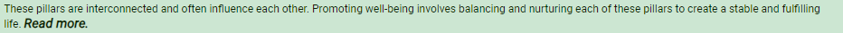

     2. At the end of the *HOW WE DO IT* section the user has the option to click the *book your call* anchor which links to the [Book a Call page](https://georgebarh.github.io/well-being-Portofolio-1/contact.html)

     

     ## [Categories page](https://georgebarh.github.io/well-being-Portofolio-1/categories.html)

 - At the top of the page, in the center of introduction div there is a navbar that gives the option to the user to click them and navigate to the sections of the Categories Page.

 The purpose of navigation bar at the top of the page is the user to be able to choose the area that he wants to learn more about without having to scroll down the page to find what he is more interested in.

   1. *The Health* anchor links to the [Health section](https://georgebarh.github.io/well-being-Portofolio-1/categories.html#health) of the Categories Page.
   2. The *Social Connections* anchor links to the [Social section](https://georgebarh.github.io/well-being-Portofolio-1/categories.html#social) of the Categories Page.
   3. The *Financial Stability* anchor links to the [Finance section](https://georgebarh.github.io/well-being-Portofolio-1/categories.html#finance) of the Categories Page.

  

   - Below the navigation bar there is a paragraph that describes that follows in the page. In this paragraph the anchor *Read below* that when the user clicks it navigates them to the [Health section](https://georgebarh.github.io/well-being-Portofolio-1/categories.html#health) of the Categories Page so as to start read more details.

   

  
  That anchor links give the chance to the user (mostly to the mobile user) not to scroll down and provides interactivity so as to make the website more user friendly.

  - At the bottom of the Categories page there is another anchor link that encourages the user to book a call with the Well-being team. Once the user clicks the anchor link will be navigated to the [Book a Call page](https://georgebarh.github.io/well-being-Portofolio-1/contact.html) which opens in another tab so as not to force the user to leave the Categories page.

   

  ## [Book a Call page](https://georgebarh.github.io/well-being-Portofolio-1/contact.html)
  - The form contains eight input fields that the user has to fill in in order to be able to sumbit the form. Only the six of the them are required. 
      1. The *Phone Number* is a non required field because a lot of users are hesitating to provide such a sensitive information and it is possible not to sumbit the form for that reason.
      2. The *Areas you want to improve* field is a non required because is working as an indication for the Well-Being team and gives the user a sense of control about the upcoming appointment.

      
      

 ## 3.2 Bugs 

 1. In the *Book a call* page the *about us* anchor link of the navigation bar could not link to the proper element.
 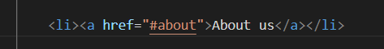

  After research in the Stack Overflow I realised that I had to write the following.

  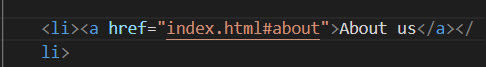

  ### __Lighthouse - Performance__
 
  After the lighthouse overview in the Chrome DevTools I realised that the performance of website was very poor because of delay to load the background images. 
    - Based on the DevTools instructions I preloaded both of the background images in the head element.

  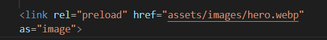

  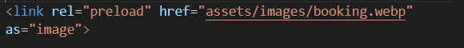

   In order to further improve the performance of the website I converted the  background images from .jpg to webp after the instruction of the Chrome DevTools.

   ### __Lighthouse - Accessibility__
  - I confirmed that the colors and fonts chosen are easy to read and accessible by running it through lighhouse in DevTools.

  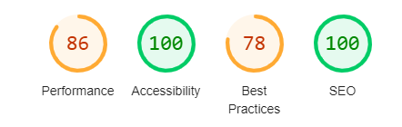

  
 ### __Validator Testing__ 

  1. HTML
         
  - [About us](https://georgebarh.github.io/well-being-Portofolio-1/) : No errors or warnings to show in [W3C validator](https://validator.w3.org/nu/).

  - [Categories page](https://georgebarh.github.io/well-being-Portofolio-1/categories.html) : No errors or warnings to show in [W3C validator](https://validator.w3.org/nu/).

  - [Book a Call page](https://georgebarh.github.io/well-being-Portofolio-1/contact.html) : 1 errors showed in [W3C validator](https://validator.w3.org/nu/).

  

  Solution :
  
   

  2.  CSS - Erros according to [(Jigsaw) validator](https://jigsaw.w3.org/css-validator/validator) : 

   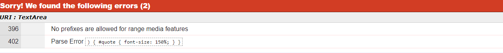

  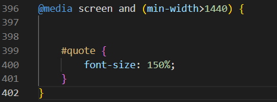

  Solution : deleted this part of the code as it was not necessery.

  # 4. Deployment
    
 - The site is deployed to GitHub pages.
      1. In the GitHub Repository, I went ot the Settings tab.
      2. In the dropdown menu, I clicked the Pages tab.
      3. From the source section drop-down menu, I selected the Main Branch.

      The live link can be found here [Well-Being Project](-https://georgebarh.github.io/well-being-Portofolio-1/).

      ## 4.1 Technical Issue

  - The images in the categories page during the Live Preview seemed to work properly without any deformation.

  

  - Once I deployed the project the images were streched
  
  

 - __Solution__ : In order to fix the bug I did the following changes in the CSS code. 

 # 5. Credits

  ## 5.1 Content
  - Instructions about the whole structure of the project were taken from the CI [Love Running](https://github.com/Code-Institute-Org/love-running-2.0) project and the videos from the first module.

  - The navigation toggle bar code was taken from the CI [Love Running](https://github.com/Code-Institute-Org/love-running-2.0) project.

  - The context of the Categories page was taken from [ChatGPT](https://chatgpt.com/).

  -  The icons in the footer were taken from [Font Awesome](https://fontawesome.com/).

  ## 5.2 Media
  - The images were taken from [Pexels](https://www.pexels.com/search/free/).
  
  - The screenshot of the README.md file for testing the responsiveness in all screens was taken from the [Am I Responsive](https://ui.dev/amiresponsive) website.

          

       

     
    
