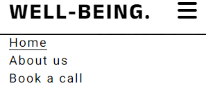
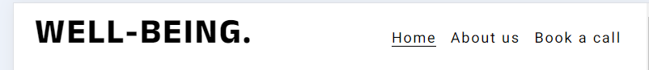

# Well-Being

Well-being is the website of non-profit organization that provides consulting services to people who are struggling with daily-life problems. Well-being consists of a team of psychologists, economists and healthcare experts with a purpose of identifing the problem of the interested people and set up a plan to make their life better. Their area of focus is based on the three basic pillars of well-being; Health, Social Connections and Financial Stability.

## Features

- __Header__ 

    - The header is featured in both pages (index.html and contact.html) and includes the logo of the organisation/ website (WELL-BEING) to the left and the navigation bar to the right. It is responsive at all screen sizes.

      - The *logo* (WELL-BEING) is an anchor link and links to the home page (index.html).
      - The *navigation bar* includes three anchor links. In mobile screens responds as a toggle button and in  tablet screens and above (>768 px) the anchor links are displayed side by side. 
       
        1. 'Home' : When the user clicks it, links them to the *home page* (index.html).
        2. 'About us' : When the user clicks it, links them to the *ABOUT US* section of the home page.
        3. 'Book a call : When the user clicks it, links to the *contact form* (contact.html).

    - This section allows to the user to easily navigate through the website without having to revert back to the previous page.

    
    
      
   # Hero Image

   - The hero section contains a background image with a cover text of a quote, relevant with the concept of the  website.
   - The background image draws the attention of the user and the *A problem properly stated is half solved* statement gives the user the urge to read more about the organization in order to find directions how to solve his problem.  

   