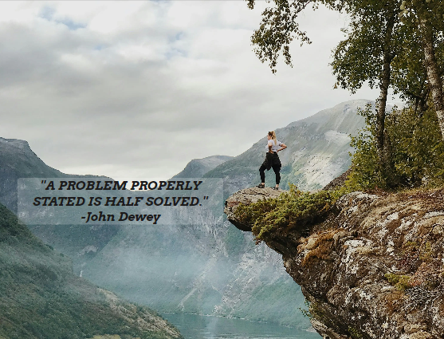

# Well-Being

Well-being is the website of non-profit organization that provides consulting services to people who are struggling with daily-life problems. Well-being consists of a team of psychologists, economists and healthcare experts with a purpose of identifing the problem of the interested people and set up a plan to make their life better. Their area of focus is based on the three basic pillars of well-being; Health, Social Connections and Financial Stability.

## Features

- __Header__ 

    - The header is featured in both pages (index.html and contact.html) and includes the logo of the organisation/ website (WELL-BEING) to the left and the navigation bar to the right. It is responsive at all screen sizes.

      - The *logo* (WELL-BEING) is an anchor link and links to the home page (index.html).
      - The *navigation bar* includes three anchor links. In mobile screens responds as a toggle button and in  tablet screens and above (>768 px) the anchor links are displayed side by side. 
       
        1. 'Home' : When the user clicks it, links them to the *home page* (index.html).
        2. 'About us' : When the user clicks it, links them to the *ABOUT US* section of the home page.
        3. 'Book a call : When the user clicks it, links to the *contact form* (contact.html).

    - This section allows to the user to easily navigate through the website without having to revert back to the previous page.

    
    
- Hero Image

   - The hero section contains a background image with a cover text of a quote, relevant with the concept of the  website.
   - The background image draws the attention of the user and the *A problem properly stated is half solved* statement gives the user the urge to read more about the organization in order to find directions how to solve his problem.  

   

- About us
  - The *About us* section is a short brief of the organization.
  
     1. The user have the opportunity to evaluate the educational background of the people with such a difficult work of improving their life.

     2. The user is able to clearly identify what this organization does without being too complicated for them.

      3. The user see how the organization's concept works, when he can be in touch with them and what happens after the introductory contact.

  - The point of this section is to briefly describe the people, the purpose and operation process with a very simple way that encourages the user to request a contact call by using the *Book a call* contact form.

  

- Video section 

   - This section gives the option to the user to get in touch with the well-being concept by watching a ted speech from the director of the organization.
   - The reference of the director in a Ted Talk provides credibility to the organization.
   - The Youtube video makes it more familiar for them and increases the chances of watching the talk and eventually spend more time in the website.

   

- Footer section

   - The footer section includes links to the relevant social media sites for Well-being.The links will open in a new tab so as to prevent the user leaves the website. We used font icons for a better user experience.
   - A potential visit to our social media pages means higher interest from the user and increases the credibility of *Well-Being*.

   

- Book a call page

  - The Book a call page is a form with input fields where the user is encourages to fill in his contact details.
  The contact is simple and requires first name, last name, phone number and email adress.  
   - The second part of the page contains a check button and a radio button and gives the opportunity to the user to provide day and time availability for the first call.

   -The point of such a simple structure is the user to be encouraged to sumbit the form by providing name, address and by clicking two buttons. The phone number is not a required field. 
    
