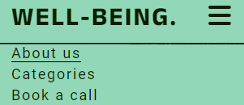

# Well-Being

## Introduction
Well-being is the website of non-profit organization that provides psychotherapy, financial and healthcare services to people who are struggling with daily-life problems. 

Well-being consists of a team of psychologists, economists and healthcare experts with a purpose of identifing the problem of the interested people and set up a plan to make their life better. Their area of focus is based on the three areas of expertise; Health, Social Connections and Financial Stability.

# Table Of Contents

# 1.Project Overview

## 1.1 Project Objective

- The main purpose of this website is to promote a non-profit psychotherapeutic organization.

 - The main purpose of this organization is to encourage people who are struggling with their daily life problems to ask support from experienced professionals. 

  - The user of the website has the opportunity to:

      1. Get brief description of the people who work there. 
      2. Learn more about the purpose, and the way the organization operates.
      3. Read more information about the theoretical basis of this group.
      4. Get in touch to request support.

- The target audience is every person who is struggling with daily-life problems and would like to ask for phychological support.

## 1.2. User stories

### First time user 
- I want to know about what the website is about.
- I want to know more about the people of this organization.
- I want to know what this organization offers.
- I want to know how they provide their services.

### Returning Users 

- I want to know more about the way they operate.
 - I want to know in more details in which areas they can provide support.
- I want to know how I can get in touch.

## Features

- __Header__ 

    - The header is featured in all pages (index.html, categories.html and contact.html) and includes the logo of the organisation/ website (WELL-BEING) to the left and the navigation bar to the right. It is responsive at all screen sizes.

      - The *logo* (WELL-BEING) is an anchor link and links to the About us page (index.html).
      - The *navigation bar* includes three anchor links. In mobile screens responds as a toggle button and in  tablet screens and above (>768 px) the anchor links are displayed side by side. 

      

      
          
    
       
        
        
   1. 'About us' : When the user clicks it, links them to the *home page* (index.html).
   2. 'Categories' : When the user clicks it, links them to the *categories page* (categories.html).
   3. 'Book a call : When the user clicks it, links to the *contact form* (contact.html).

    - This section allows to the user to easily navigate through the website without having to revert back to the previous page.

- Hero Image

   - The hero section contains a background image with a cover text of a quote, relevant with the concept of the  website.
   - The background image draws the attention of the user and the *A problem properly stated is half solved* statement gives the user the urge to read more about the organization in order to find directions how to solve his problem.  

   

- About us
  - The *About us* section is a short brief of the organization.
  
     1. The user have the opportunity to evaluate the educational background of the people with such a difficult work of improving their life.

     2. The user is able to clearly identify what this organization does without being too complicated for them.

      3. The user see how the organization's concept works, when he can be in touch with them and what happens after the introductory contact.

  - The point of this section is to briefly describe the people, the purpose and operation process with a very simple way that encourages the user to request a contact call by using the *Book a call* contact form.

  

- Video section 

   - This section gives the option to the user to get in touch with the well-being concept by watching a ted speech from the director of the organization.
   - The reference of the director in a Ted Talk provides credibility to the organization.
   - The Youtube video makes it more familiar for them and increases the chances of watching the talk and eventually spend more time in the website.

   

- Footer section

   - The footer section includes links to the relevant social media sites for Well-being.The links will open in a new tab so as to prevent the user leaves the website. We used font icons for a better user experience.
   - A potential visit to our social media pages means higher interest from the user and increases the credibility of *Well-Being*.

   

- Book a call page

  - The Book a call page is a form with input fields where the user is encourages to fill in his contact details.
  The contact is simple and requires first name, last name, phone number and email address.  
   - The second part of the page contains a check button and a radio button and gives the opportunity to the user to provide day and time availability for the first call.

   -The point of such a simple page structure is the user to be encouraged to sumbit the form by providing name, address just by clicking two buttons. The phone number and the *Areas you want to improve* is not a required field. 

   
   

   ## Testing

   I have tested the responsiveness of the website in Google Chrome, Microsoft Edge, and Mozilla Firefox and every thing works as it should.

- Header 
    - The *logo* (WELL-BEING) is an anchor link and links to the home page (index.html).
    - The *navigation bar* includes three anchor links. In mobile screens responds as a toggle button and in  tablet screens and above (>768 px) the anchor links are displayed side by side. 
       
      1. 'About us' : When the user clicks it, links them to the *home page* (index.html).
        2. 'Categories' : When the user clicks it, links them to the *categories page* (categories.html).
        3. 'Book a call : When the user clicks it, links to the *contact form* (contact.html).

- Footer 
  - The footer contains three font awesome icons that each of them links the user to the corresponding social media page. The pages are opening in a new tab in order the user not leave the home page.

- Book a call page 
  - The form contains eight input fields that the user has to fill in in order to be able to sumbit the form. Only the six of the them are required. 
      1. The *Phone Number* is a non required field because a lot of users are hesitating to provide such a sensitive information and it is possible not to sumbit the form for that reason.
      2. The *Areas you want to improve* field is a non required because is working as an indication for the Well-Being team and gives the user a sense of control about the upcoming appointment

- Bugs 

 1. In the *Book a call* page the *about us* anchor link of the navigation bar could not link to the proper element.
 
  After research in the Stack Overflow I realised that I had to write the following.
  

 2. After the lighthouse overview in the Chrome DevTools I realised that the performance of website was very poor because of delay to load the background images. 
    - Based on the DevTools instructions I preloaded both of the background images in the head element.
    
    

    3. In order to further improve the performance of the website I converted the  background images from .jpg to webp after the instruction of the Chrome DevTools.

    

    - Validator Testing 
      1. HTML
         - No errors or warnings to show in [W3C validator](https://validator.w3.org/nu/?doc=https%3A%2F%2Fcode-institute-org.github.io%2Flove-running-2.0%2Findex.html#textarea)
      2.  CSS 
          - Erros according to [(Jigsaw) validator](https://jigsaw.w3.org/css-validator/validator) : 

          
          

          Solution : delete this part of the code as it was not absolutely necessery.
        3. Accessibility
           - I confirmed that the colors and fonts chosen are easy to read and accessible by running it through lighhouse in DevTools.

           

  ## Deployment
    
 - The site is deployed to GitHub pages.
      1. In the GitHub Repository, I went ot the Settings tab.
      2. In the dropdown menu, I clicked the Pages tab.
      3. From the source section drop-down menu, I selected the Main Branch.

      The live link can be found here [Well-Being Project](-https://georgebarh.github.io/well-being-Portofolio-1/).

 ## Credits

  - Content
     - Instructions about the whole structure of the project were taken from the CI [Love Running](https://github.com/Code-Institute-Org/love-running-2.0) project.

     - The navigation toggle bar code was taken from the CI [Love Running](https://github.com/Code-Institute-Org/love-running-2.0) project.

  The icons in the footer were taken from [Font Awesome](https://fontawesome.com/).

  - Media
    - Both the background images was taken from [Pexels](https://www.pexels.com/search/free/).

          

       

     
    
